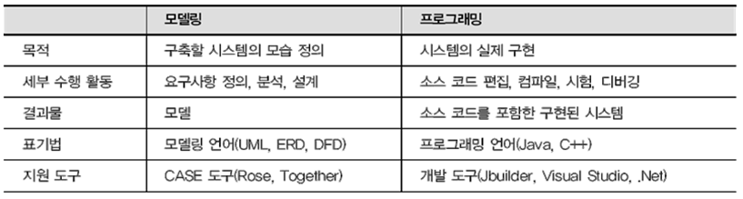

# hanati - 180820-day3

---

## OOP (객체지향 프로그래밍)

* 함수가 중심이 되서 프로그래밍 하는 방식, 순차적 흐름을 중시 - 절차지향적 프로그래밍 방식

* 프로그램도 객체라는 독립된 단위로 구성하고, 이 객체들 간의 상호작용에 의해 프로그램이 실행되도록 하는 프로그램 개발 방법

* 프로그램을 단순히 순차적인 명령어의 흐름으로 보는 시각에서 벗어나 여러 개의 독립된 모듈(객체) 단위로 파악하고, 각각의 모듈(객체)들이 상호작용함으로써 데이터를 처리하는 방식.

* 장점

  * 생산성을 높일 수 있다.

  * 유지보수 및 확장에 용이함

  * SW 개발과정 (요구정의-분석-설계-구현-테스트/디버깅-배치) 상 자연스러운 분석 및 설계가 용이

---
## 객체의 구성요소

* 현실세계의 객체(object)
  * 실생활에 존재하는 명사형의 모든 실체(사람, 사물, 개념 등)을 말한다.
  * 객체는 식별 가능(이름이 존재)하며, 자신과 관련된 정보(속성)와 행위(기능)를 외부에 제공한다.
* Class
  * 현실 세계의 객체를 프로그램적으로 표현(정의)한 청사진(템플릿) - 객체추상화 
  * '메모리에 올리고자 하는 데이터 타입' 이라고 정의 할 수 있다.
  * 클래스는 객체의 정보 저장을 위한 변수들과 객체의 기능을 정의한 메소드들로 구성된다.
* Instance
  * 클래스로부터 메모리에 생성(할당)된 실체 - 소프트웨어 객체
  * 그니까 HDD에 존재하는 클래스를 메모리에 올렸을 때 그것을 인스턴스라고 한다.
  * 인스턴스는 자신 고유의 상태정보를 가지며, 클래스에서 정의한 기능을 수행할 수 있다.

* 메시지
  * 메모리상의 인스턴스들은 각각 독립적이고, 메세지 송수신을 통해 서로 상호작용한다.


---

## 객체지향 프로그래밍 절차

1. 객체 모델링

   * 프로그램으로 표현하고자 하는 실행할 객체의 속성, 기능, 상호작용등을 이해하기 쉬운 도형과 기호를 이용하여 표현하는 것이다.

   * UML 클래스 다이어그램을 이용한 객체 모델 작성

     

2. 클래스 정의

   * 실세계의 객체를 프로그램으로 표현(구현)하는 것

3. 인스턴스(소프트웨어 객체) 생성 및 사용

   * 클래스를 이용하여 메모리상에 인스턴스를 생성하고, 인스턴스들간의 메시지 교환(메서드 호출)을 통해 프로그램이 실행되도록 하는 단계

---

## 객체 모델링

* 모델 : 대상물에 대한 정보를 제공하기 위해 이해하기 쉬운 형태로 표현한 것
  * 예시) 지하철 노선도, 프라모델, 모델하우스등
* 모델링 : 모델을 만드는 것이다.
* 필요성 
  * 시스템 개발 단계별로 모델을 작성함으로서 시스템을 시각적으로 이해하기 쉽다.
  * 시스템 이해 당사자(고객, 분석가, 설계사, 개발자)들의 의사소통 수단으로 사용한다.
  * 고객의 요구사항에 대한 명확한 이해, 보다 명확한 설계와 유지보수가 용이하다.
  * 시스템의 구조나 기능을 명세화하고, 시스템을 구축하는 안내가 될 기본틀을 제공.



---

## 객체 모델 샘플링

* 현실세계의 자동차와 은행계좌가 가지는 속성과 기능을 UML에서 제공하는 클래스다이어그램을 통해 이해하기 쉽게 표현  
* 소프트웨어 개발 과정 중 분석 및 설계 단계에서 사용되는 클래스다이어그램

---

## 클래스 구조

*구성요소*

```java
  [접근제한자] [기타 제한자] class 클래스이름 [extends 부모클래스] [implements 인터페이스] {
  	[멤버변수(인스턴스변수 or 클래스변수)]
  	[상수]
  	[static 초기화 블록]
  	[생성자]
  	[멤버메소드(인스턴스메소드 or 클래스메소드)]
  	[내부클래스]
  }
```

*클래스 예시*

```java
package day3_180820;

/**
 * 일상생활의 객체를 추상화 하기 위한 모델링 클래스 정의
 * 은행계좌 객체
 */

class Account {
	// 인스턴스 변수 선언
	String accountNum;
	String accountOwner;
	int passwd;
	long restMoney;
	
	long deposit(long money) {
		restMoney += money;
		return restMoney;
	}
	
	long withdraw(long money) {
		restMoney -= money;
		return restMoney;		
	}
	
	long getRestMoney() {
		return restMoney;
	}
	
	boolean checkPasswd(int pw) {
		return passwd == pw;
	}

}
```

* 인스턴스 변수 

  * 클래스 정의 시 객체의 속성(상태정보) 저장을 위한 변수
  * 메서드의 내부에 선언되는 지역변수와 달리 클래스 내부에 선언
  * 지역변수는 메소드 내부에서만 사용가능하지만, 인스턴스 변수는 클래스 내부의 모든 메소드에서 사용 가능하다.

```java
  [접근제한자] [기타 제한자] 데이터타입 변수이름;
  //ex
  int age;
  String userName;
  ```

* 인스턴스 메소드

  * 클래스 정의 시 객체의 속성과 관련된 행위(기능)을 표현하기 위해 메소드 정의

```java
  [접근제한자] [기타 제한자] 데이터타입 메서드이름(매개변수리스트) {
  	//  기능 구현(연산자, 제어문 등 사용)
  }
  //ex
  int sum(int x, int y) {
  	return x + y;
  }
  ```

---

## 생성자 (Constructor)

* 클래스로부터 인스턴스(SW객체)가 생성될 때, 객체 초기화를 위해 제공하는 특수한 형식의 메서드이다.  목적은 인스턴스 변수의 초기화
* 생성자 이름은 반드시 클래스 이름과 동일해야만하고, 리턴타입을 명시하지 않는다.
* 생성자는 반드시 `new` 키워드와 함께 호출해야만 한다.


```java
 [접근제한자] 클래스이름(매개변수리스트..){ // 아예 return type이 없다.
 	// 인스턴스 변수 초기화 코드...
 }
```

*account.java*

```java
...
	// 인스턴스 변수 선언
	String accountNum; // string은 class이름 입니다.
	String accountOwner; // 만약 string을 초기화 시켜주지 않으면 null값으로 잡히게 됩니다.
	int passwd; // int는 초기화 시키지 않으면 0으로 초기화된다.
	long restMoney;

	// 생성자
	Account(String num, String Owner, int pw, long money) {
		accountNum = num;
		accountOwner = Owner;
		passwd = pw;
		restMoney = money;
	}
...  
```

*accountExample.java*

```java
...

		// 생성자를 이용한 객체 생성
		Account account = new Account("1111-2222-3333","Mr.kim", 1234, 100000);
...
```

* 디폴트 생성자
  * 컴파일 할때 컴파일러에서 자동으로 생성되는 매개변수가 없는 생성자.

```java
...
Account(){
    accountNum = null;
    accountOwner = null;
    passwd = 0;
    restMoney = 0;
}
...
```

* 만약 내가 생성자를 만들었다면, 디폴트 생성자는 만들어지지 않는다.

* 생성자 overloading(중복 정의)
  * 매개변수의 데이터 타입과 개수를 달리하면 동일한 이름으로 여러 개의 생성자를 정의할 수 있다. 
  * 다양한 방법으로 인스턴스를 생성할 수 있는 장점을 가진다.
  * 왜 이렇게 여러개를 하는가? - 다형성과 관련된다.
  * 매개변수의 타입 순서와 개수가 똑같고, 매개변수 이름만 바뀐다. = 오버로딩 X
  * 매개변수 타입의 순서가 다르지만 개수가 똑같다. = 오버로딩 X

````java
...
// 생성자
	Account(String num, String Owner, int pw, long money) {
		accountNum = num;
		accountOwner = Owner;
		passwd = pw;
		restMoney = money;
	}
	
	// 생성자 오버로딩
	Account(String num, String Owner, int pw) {
		accountNum = num;
		accountOwner = Owner;
		passwd = pw;
	}
	
	Account(String num, String Owner) {
		accountNum = num;
		accountOwner = Owner;
	}
	// 생성자 오버로딩 (default Constructor)
	Account() {
	}
...
````

---

## 예약어 this

* 현재 실행중인 (메모리에 생성되어 있는) 인스턴스를 참조하는데 사용한다.
* 생성자 또는 메소드의 매개변수와 인스턴스 변수가 같을 경우 사용
* 클래스 내의 다른 생성자를 호출할 때 사용 - this();
* 불필요한 코드 중복을 막을 수 있다.
* 서로 양방향으로 참조하는 것이다.

```java
class Box { 
  int width;
  int height;
  int depth;
  public Box(int width, int height, int depth) {
    this.width = width; // 현재 객체의 인스턴스 변수 width를 의미한다. this를 사용함으로서 인스턴스 변수와 다른 이름의 매개변수를 선언할 필요가 없다.
    this.height = height;
    this.depth = depth;
  }
} 
```

*this(); Example*

```java
class Box {
  int width;
  int height;
  int depth;
  public Box() {
    this(1,1,1);
  }
  public Box(int w) {  
    this(w,1,1);
  }
  public Box(int w, int h) {  
    this(w,h,1);
  }
  public Box(int width, int height, int depth)   {
    this.width=width;  
    this.height=height;
    this.depth=depth;
  }
}
```

* 이 클래스는 어떤 형태로 객체가 생성된다하여도, 결국은 마지막 생성자가 호출된다.

  여기서 사용된 **this()는 같은 클래스 내의 다른 생성자를 호출하는 역할**을 한다.

```java
Class JavaTest{
     int value1;
     double value2;
     //디폴트 생성자
     public JavaTest(){ }
     //int형 변수를 인자로 받는 생성자
     public JavaTest(int x){
          value1 = x;
     }
     //double형 변수를 인자로 받는 생성자
     public JavaTest(double y){
          value2 = y;
     }
     //int형 변수와 double형 변수를 인자 받는 생성자
     public JavaTest(int x, double y){
          //위의 두개의 생성자를 각각 호출한다.
          this(x);     //JavaTest(int x) 호출
         			  //this()는 생성자의 첫 줄에서 단 한번밖에 사용할 수 없다.
          this(y);     //에러 발생
          this.value2 = y;
     }
```

---

## 클래스 접근 제한자(Modifiers)

* 클래스 정의 시 클래스를 접근할 수 있는 권한을 부여할 수 있는 키워드

  ```java
  [public/생략]  class ClassName {
      //…
  }    
  ```

* **public**: public은 다른 패키지의 어떤 클래스에서도 이 클래스를 접근(클래스의 객체 생성) 할 수 있다.

* 접근 제한자를 지정하지 않으면 (Default) 같은 패키지내의 클래스들만 접근 가능.
---
## 변수 접근제한자

  ```java
  [public/protected/생략/private]  데이터타입 변수명;
  ```

* 자바는 객체지향의 특성인 정보 은폐(information hiding)를 제공하기 위해 인스턴스 변수에 접근 제한자를 사용

  * 접근 제한자가 없는 인스턴스 변수는 동일한 패키지에서 사용 가능


* `public`으로 선언된 인스턴스 변수는 패키지에 상관없이 모든 클래스에서 사용가능

```java
class Box {
    public int width;
    public int height;
    public int depth;
    public long idNum;
}

class PublicDemo {
  public static void main(String args[]) {
    Box mybox1 = new Box();
    mybox1.width = 7;     // 접근 가능 
    mybox2.depth = 20;    // 접근 가능
  }
}
```

* `protected`로 선언된 멤버 변수는 소속된 클래스의 하위 클래스와 소속된 클래스와 같은 패키지의 클래스에서만 사용 가능

```java
class Box {
  private int width;  
  private int height;
  private int depth;
  protected int count;  // 이 클래스와 이 클래스의 하위 클래스에서 사용
  ..........		   // 사실 이렇게 쓸 일이 없지...
 }

class ProtectedDemo1 extends Box   {
 // extends를 이용하여 Box 클래스의 하위 클래스로 생성
  public static void main(String args[]) { 
    Box mybox2 = new Box();
    mybox2.count = 7;  // 접근 가능
    ……………
```

* `private`로 선언된 인스턴스 변수는 소속된 클래스 내에서만 사용 가능

```java
class Box {
    private int width;    // private로 선언 이 클래스 내부에서만 사용
    private int height;	  // 사실 이렇게 쓸 일이 없지...
    private int depth;
}
class PrivateDemo {
  public static void main(String args[]) {
      Box mybox1 = new Box(10, 20, 30);
      mybox1.width = 7;   // 에러 발생
   }
}
```

* Setter / Getter 메소드
  * 프로그램은 외부에서 임의로 수정할 수 없도록 해야한다. 프로그램을 사용자가 마음대로 수정할 수 있다면 기껏 프로그램을 개발한 의미가 없다. 객체 지향 프로그램에서는 데이터 자체는 외부에서 접근할 수 없도록 하고, 메소드만 공개해서 이 중 유효한 값들을 데이터로 저장한다.
  * alt + shift + s, r누르고 옵션 체크하고 만들어준다.

```java
// setter, getter 메소드
	String getAccountNum() {
		return accountNum;
	}

	void setAccountNum(String accountNum) {
		this.accountNum = accountNum;
	}

	String getAccountOwner() {
		return accountOwner;
	}

	void setAccountOwner(String accountOwner) {
		this.accountOwner = accountOwner;
	}

	int getPasswd() {
		return passwd;
	}

	void setPasswd(int passwd) {
		this.passwd = passwd;
	}

	void setRestMoney(long restMoney) {
		this.restMoney = restMoney;
	}

	long getRestMoney() {
		return restMoney;
	}
```

---

## Uml 그리기

* 처음 default로 시작
* `<<analysisModel>>`에서 Main에 그린다.
* +: public, -:private, #:protected

---

## 금일 실습한 코드

*account.java*

```java
package day3_180820;

/**
 * 일상생활의 객체를 추상화 하기 위한 모델링 클래스 정의 은행계좌 객체
 */

class Account {
	// 인스턴스 변수 선언
	String accountNum; // string은 class이름 입니다.
	String accountOwner; // 만약 string을 초기화 시켜주지 않으면 null값으로 잡히게 됩니다.
	int passwd; // int는 초기화 시키지 않으면 0으로 초기화된다.
	long restMoney;

	// 생성자
	public Account(String accountNum, String accountOwner, int passwd, long restMoney) {
		this.accountNum = accountNum;
		this.accountOwner = accountOwner;
		this.passwd = passwd;
		this.restMoney = restMoney;

	}

	// 생성자 오버로딩
	public Account(String accountNum, String accountOwner, int passwd) {
		//this.accountNum = accountNum;
		//this.accountOwner = accountOwner;
		//this.passwd = passwd;
		this(accountNum, accountOwner, 0, 0);
		// 자신의 클래스 안에서 또다른 생성자를 호출할 때 이친구를 부릅니다.
	}

	public Account(String accountNum, String accountOwner) {
		this.accountNum = accountNum;
		this.accountOwner = accountOwner;
	}

	// 생성자 오버로딩 (default constructor)
	public Account() {
		this(null, null);
	}

	// setter, getter 메소드
	public String getAccountNum() {
		return accountNum;
	}

	public void setAccountNum(String accountNum) {
		this.accountNum = accountNum;
	}

	public String getAccountOwner() {
		return accountOwner;
	}

	public void setAccountOwner(String accountOwner) {
		this.accountOwner = accountOwner;
	}

	public int getPasswd() {
		return passwd;
	}

	public void setPasswd(int passwd) {
		this.passwd = passwd;
	}

	public long getRestMoney() {
		return restMoney;
	}
	
	public void setRestMoney(long restMoney) {
		this.restMoney = restMoney;
	}


	// 인스턴스 메소드
	long deposit(long money) {
		restMoney += money;
		return restMoney;
	}

	long withdraw(long money) {
		restMoney -= money;
		System.out.printf("%d원 출금했습니다.\n", money);
		return restMoney;
	}

	boolean checkPasswd(int pw) {
		return passwd == pw;
	}

}
```

*AccountExample.java*

```java
package day3_180820;

/**
 * 프로그램 실행을 위한 애플리케이션 클래스 정의
 */
import java.util.Scanner;

public class AccountExample {
	public static void main(String[] args) {
		System.out.println("은행 계좌 애플리케이션 시작됨....");

		// 클래스로부터 객체(인스턴스) 생성
		// Account account = new Account(); // reference 타입 선언하고, new 명령어를 통해서 메모리 할당.

		// 인스턴스의 속성과 기능 사용
		//account.accountNum = "1111-2222-3333";
		//account.accountOwner = "Mr.Kim";
		//account.restMoney = 100000;
		//account.passwd = 1234;
		//System.out.println(account.accountNum);

		// 생성자를 이용한 객체 생성
		Account account = new Account("1111-2222-3333", "Mr.kim", 1234, 100000);

		int passwd;
		System.out.print("비밀번호를 입력하세요 : ");
		Scanner sc = new Scanner(System.in);
		passwd = sc.nextInt();

		boolean result = account.checkPasswd(passwd);
		if (result) {
			long money = account.deposit(100000);
			System.out.println("입금 후 잔액 : " + money);
			money = account.withdraw(10000);
			System.out.println("출금 후 잔액 : " + money);
		} else {
			System.out.println("비밀번호를 확인하세요");
		}

		//Account account2 = new Account();
		//인스턴스 변수의 경우 JVM에 의해 초기화된다.
		//System.out.println(account2.accountNum);
		//System.out.println(account2.restMoney);
		//account2.accountNum = "2222-3333-4444";
		//account2.accountOwner = "Mr.song";
		//account2.restMoney = 500000;
		//account2.passwd = 1111;

		Account account2 = new Account("2222-3333-4444", "Mr.song");
		
		account2.setPasswd(12345);
		account2.setRestMoney(700000);
		
		System.out.println(account2.getAccountNum());
		System.out.println(account2.getAccountOwner());
		System.out.println(account2.getPasswd());
		System.out.println(account2.restMoney);

		Account account3 = new Account();

		System.out.println("은행 계좌 애플리케이션 종료됨....");
	}
}
```
